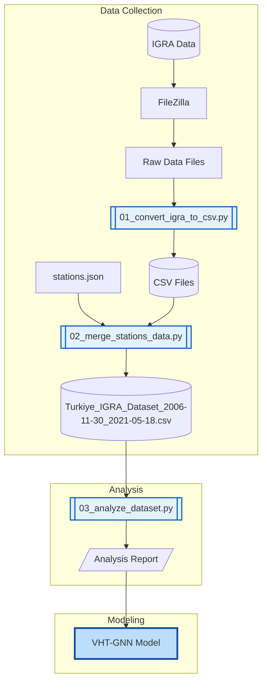

# IGRA Data Collection Pipeline

This directory contains scripts for downloading and processing NOAA IGRA (Integrated Global Radiosonde Archive) raw data for the VHT-GNN model.

## Pipeline Overview



## Data Flow

### 1. Download IGRA Data
- Source: [NOAA IGRA FTP](https://www.ncei.noaa.gov/pub/data/igra/)
- Download using FileZilla or similar FTP client
- Files: `TUM000xxxxx-data.txt` (one per station)

### 2. Convert to CSV (`01_convert_igra_to_csv.py`)
- Converts IGRA raw format to individual CSV files
- Output structure: `wyoming_format/{station_id}/{year}/{month}/{station}_{YYYYMMDD}_{HH}Z.csv`
- Calculates derived variables (relative humidity, mixing ratio)

### 3. Merge Stations (`02_merge_stations_data.py`)
- Combines all stations into single dataset
- Filters surface + standard pressure levels only
- Date range: 2006-11-30 → 2021-05-18
- Output: `Turkiye_IGRA_Dataset_2006-11-30_2021-05-18.csv`

### 4. Analyze Dataset (`03_analyze_dataset.py`)
- Data quality statistics
- Missing data rates by variable and pressure level
- Data window analysis for GNN training sequences

### 5. Model Input
- Output dataset is ready for VHT-GNN model
- Further preprocessing (normalization, windowing) done in model pipeline

## Stations

| ID | Name | Lat | Lon | Elevation |
|----|------|-----|-----|-----------|
| 17064 | Istanbul | 40.91 | 29.16 | 19m |
| 17130 | Ankara | 39.95 | 32.88 | 891m |
| 17030 | Samsun | 41.28 | 36.30 | 4m |
| 17220 | Izmir | 38.39 | 27.08 | 31m |
| 17240 | Isparta | 37.78 | 30.57 | 998m |
| 17351 | Adana | 37.00 | 35.34 | 28m |
| 17095 | Erzurum | 39.91 | 41.25 | 1861m |
| 17281 | Diyarbakir | 37.54 | 40.12 | 675m |

## Standard Pressure Levels

Surface + [1000, 850, 700, 500, 400, 300, 250, 200, 150, 100, 70, 50, 30, 10] hPa

## Output Variables

| Variable | Unit | Description |
|----------|------|-------------|
| datetime | - | Observation time (YYYY-MM-DD HH:00) |
| hour | - | Observation hour (0 or 12 UTC) |
| station_id | - | WMO station identifier |
| pressure | hPa | Atmospheric pressure |
| level_type | - | surface or standard |
| geopotential | m | Geopotential height |
| temperature | °C | Air temperature |
| relative_humidity | % | Relative humidity (reliable up to 200 hPa) |
| wind_speed | m/s | Wind speed |
| wind_direction | ° | Wind direction |

## Usage

```bash
# 1. Convert IGRA raw data to CSV files
python 01_convert_igra_to_csv.py

# 2. Merge all stations into single dataset
python 02_merge_stations_data.py

# 3. Analyze the dataset
python 03_analyze_dataset.py
```

## Requirements

```
pandas
numpy
metpy
```

## Notes

- Relative humidity data above 200 hPa is unreliable and should not be used in modeling
- Merged dataset spans 2006-11-30 → 2021-05-18; individual station availability varies within this period

## Sample Data

### stations.json
```json
{
  "stations": [
    {
      "station_id": "17064",
      "name": "Istanbul",
      "lat": 40.91,
      "lon": 29.16,
      "elevation": 19
    },
    // ... 7 more stations
  ],
  "metadata": {
    "data_period": "2006-11-30 to 2021-05-18",
    "total_stations": 8,
    "country": "Türkiye",
    "source": "NOAA IGRA"
  }
}
```

### Turkiye_IGRA_Dataset_2006-11-30_2021-05-18.csv (first 5 rows)
```csv
datetime,hour,station_id,name,lat,lon,elevation,pressure,level_type,geopotential,temperature,relative_humidity,wind_speed,wind_direction
2006-11-30 00:00,0,17030,Samsun,41.28,36.3,4,1030.0,surface,4.0,5.8,77.1,2.1,280.0
2006-11-30 00:00,0,17030,Samsun,41.28,36.3,4,1000.0,standard,246.0,7.6,65.7,5.7,310.0
2006-11-30 00:00,0,17030,Samsun,41.28,36.3,4,850.0,standard,1556.0,-4.3,99.2,1.5,265.0
2006-11-30 00:00,0,17030,Samsun,41.28,36.3,4,700.0,standard,3096.0,-7.1,41.1,12.3,30.0
2006-11-30 00:00,0,17030,Samsun,41.28,36.3,4,500.0,standard,5650.0,-22.3,3.0,21.1,15.0
2006-11-30 00:00,0,17030,Samsun,41.28,36.3,4,400.0,standard,7260.0,-31.7,5.9,36.5,30.0
2006-11-30 00:00,0,17030,Samsun,41.28,36.3,4,300.0,standard,9230.0,-45.9,,35.0,15.0
2006-11-30 00:00,0,17030,Samsun,41.28,36.3,4,250.0,standard,10420.0,-53.7,,29.3,350.0
2006-11-30 00:00,0,17030,Samsun,41.28,36.3,4,200.0,standard,11840.0,-59.9,,33.4,330.0
2006-11-30 00:00,0,17030,Samsun,41.28,36.3,4,150.0,standard,,,,,
2006-11-30 00:00,0,17030,Samsun,41.28,36.3,4,100.0,standard,,,,,
2006-11-30 00:00,0,17030,Samsun,41.28,36.3,4,70.0,standard,,,,,
2006-11-30 00:00,0,17030,Samsun,41.28,36.3,4,50.0,standard,,,,,
2006-11-30 00:00,0,17030,Samsun,41.28,36.3,4,30.0,standard,,,,,
2006-11-30 00:00,0,17030,Samsun,41.28,36.3,4,10.0,standard,,,,,
2006-11-30 12:00,12,17030,Samsun,41.28,36.3,4,1029.0,surface,4.0,12.0,46.9,2.1,230.0
2006-11-30 12:00,12,17030,Samsun,41.28,36.3,4,1000.0,standard,241.0,8.6,57.1,3.6,5.0
2006-11-30 12:00,12,17030,Samsun,41.28,36.3,4,850.0,standard,1557.0,-2.7,93.5,4.6,285.0
2006-11-30 12:00,12,17030,Samsun,41.28,36.3,4,700.0,standard,3094.0,-4.7,13.3,9.8,40.0
2006-11-30 12:00,12,17030,Samsun,41.28,36.3,4,500.0,standard,5680.0,-19.7,12.3,22.1,30.0
```
